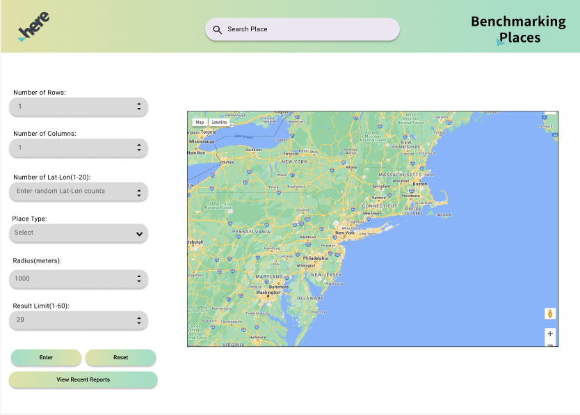
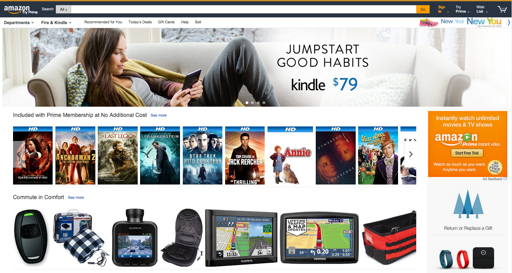
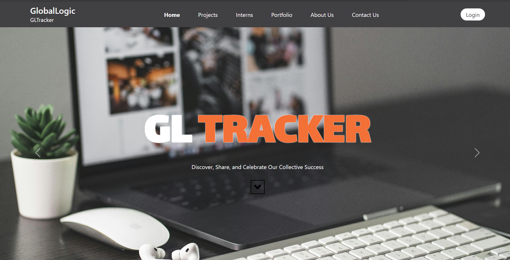
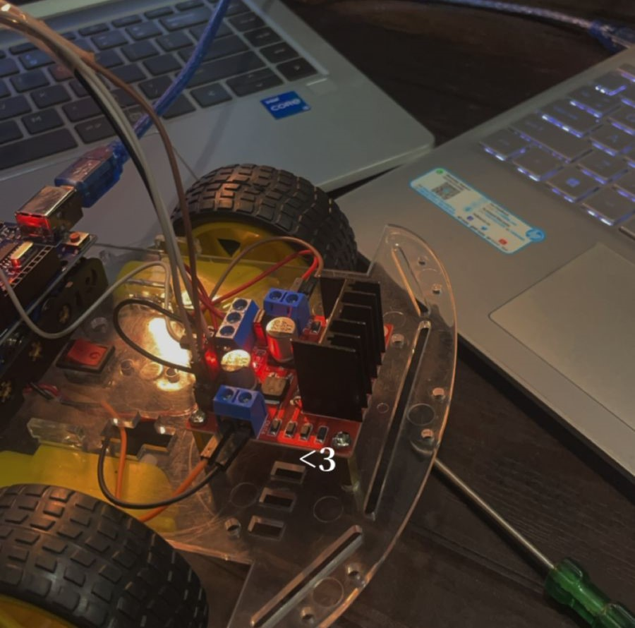
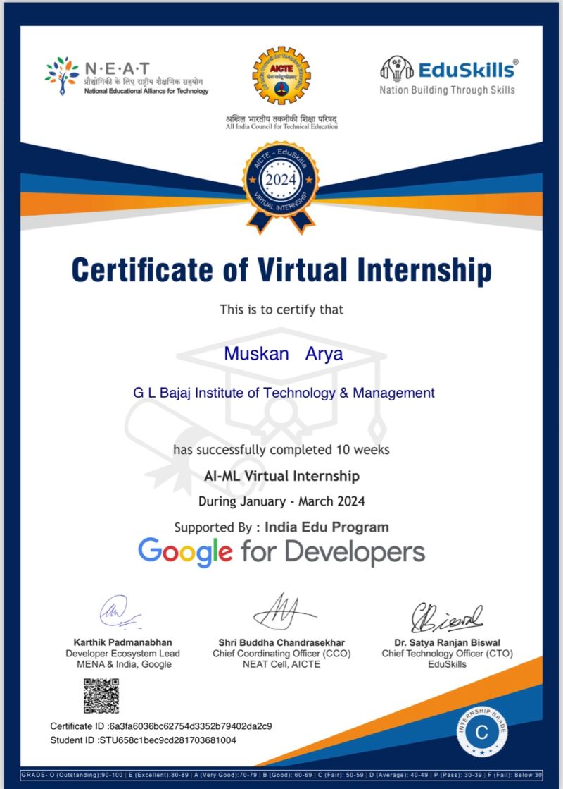
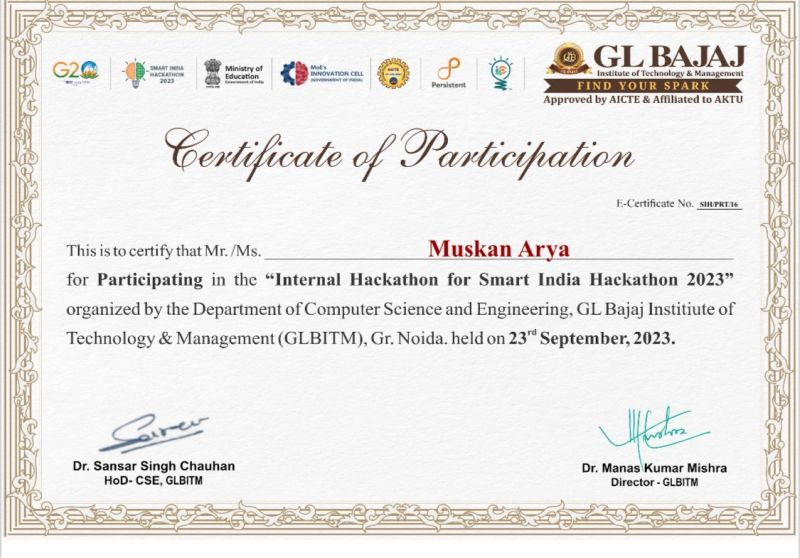
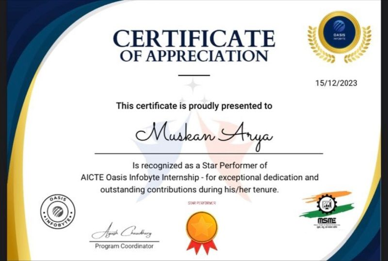
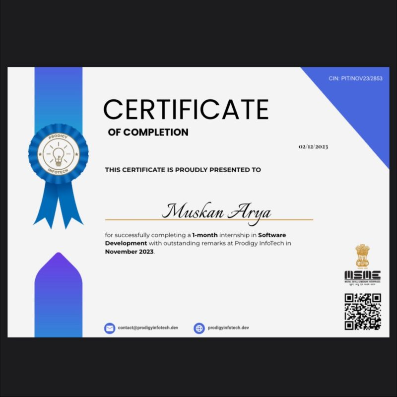
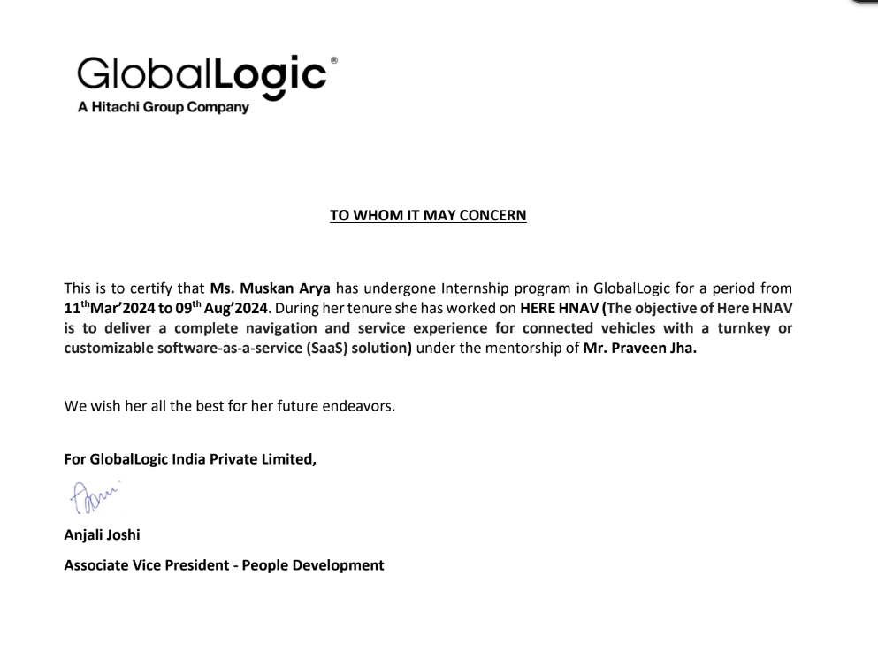

<h1 align="center">Hi 👋, I'm Muskan Arya</h1>
<h3 align="center">A self-taught Fullstack Developer from Bulandshahr, Uttar Pradesh.</h3>

  

  
  

<h2 align="center">About Me</h2>

I'm passionate about solving challenging problems and creating exceptional digital experiences. 	I am a team player with excellent communication, passionate, 
								and self-learned coders. Learning and developing secure, 
								efficient, and scalable web applications and web-based management
								systems by writing standard, well-documented, and efficient codes.
								I want to utilize my institutional skills along with my professional
								skills to implement innovative ideas into reality.
. Currently, I'm focusing on expanding my knowledge in full-stack development and contributing to impactful projects.

📫 How to reach me: <a href="mailto:muskanarya2210@gmail.com">muskanarya2210@gmail.com</a>

<h2 align="center">Tech Stack</h2>

  
  
  
  
  
  
  
  
  
  
  
  
  
  
  

  

  

  

  

<h2 align="center">Projects</h2>

### Benchmarking Places

  

This React-based web application empowers users to explore places and organize them into grid sections, enabling efficient nearby searches for points of interest. Whether planning a trip or exploring your surroundings, Benchmarking Places offers an intuitive interface and robust features for a seamless experience.

### Amazon-Clone

  

This project replicates the core functionalities of Amazon, providing a familiar shopping experience with a modern UI. It includes features like product browsing, cart management, and checkout processes. The clone serves as a hands-on approach to understanding e-commerce web development.

### GuideEra

  

GuideEra is a comprehensive educational platform offering textbooks, roadmaps, and resources for various educational streams. This project was built to assist students and learners by providing structured learning materials and guidance to achieve academic excellence.

### GL Tracker

  

The GL Tracker is an intern tracking system that showcases my full-stack development skills. It includes features like intern registration, progress tracking, and report generation, providing a complete solution for managing internship programs efficiently.

### Indoor Navigation Robot

  

Developed an autonomous robot capable of navigating indoor environments with precision. This project leverages Arduino technology and sensors to create a smart navigation system, highlighting my skills in robotics and embedded systems.

<h3 align="center">🚧 More Projects Coming Soon! 🚧</h3>

<h2 align="center">Certificates</h2>

### AICTE Eduskills Virtual Internship

  

During this virtual internship, I focused on AI-ML, gaining hands-on experience in developing machine learning models and implementing AI-driven solutions. This internship allowed me to deepen my understanding of AI technologies and their real-world applications.

### Smart India Hackathon

  

As a team leader, I spearheaded a full-stack project during the Smart India Hackathon. Our team developed an innovative solution that addressed real-world challenges, showcasing our ability to collaborate and deliver results under tight deadlines.

### Oasis Infobyte

  

Completed an internship at Oasis Infobyte, where I gained practical experience in software development. The internship provided an opportunity to work on diverse projects, enhancing my skills in coding, debugging, and software design.

### Prodigy Infotech

  

My internship at Prodigy Infotech involved working on advanced software development projects. I collaborated with seasoned developers and contributed to key projects, honing my technical skills and gaining industry experience.

### GlobalLogic

  

At GlobalLogic, I contributed to a full-stack project focused on developing a navigation and service platform for connected vehicles. This experience enhanced my understanding of large-scale software development and the integration of cutting-edge technologies.

<h2 align="center" style="color: #FF0000;">🚀 More Projects and Certificates Coming Soon! 🚀</h2>
